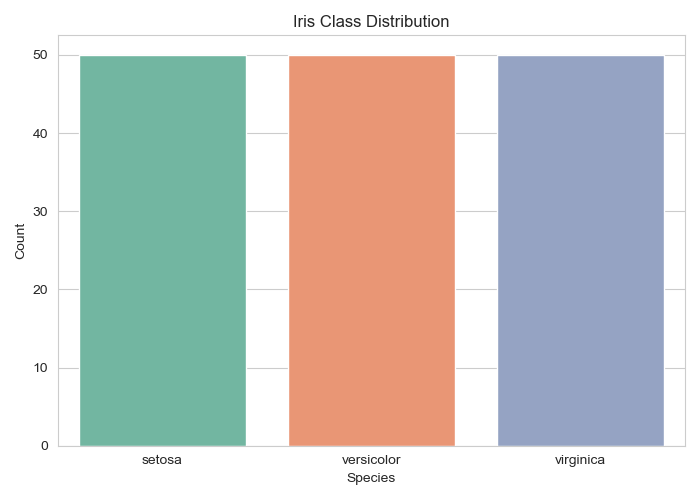
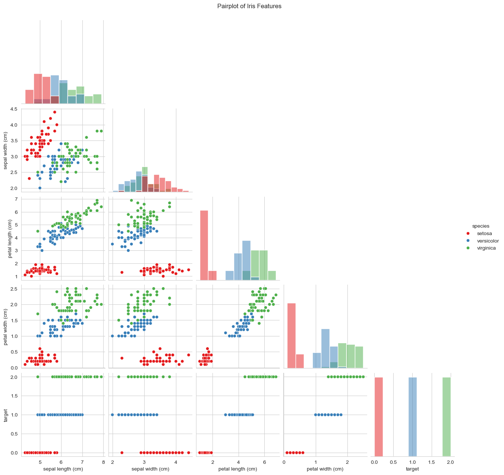
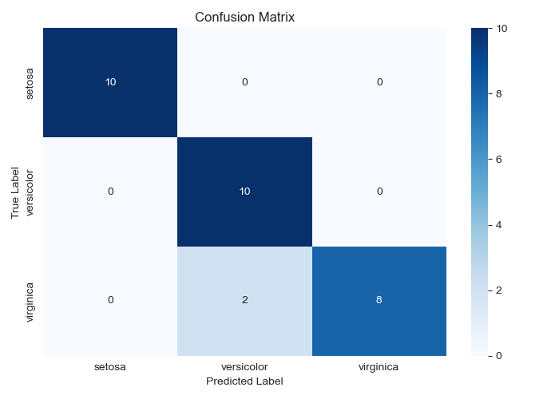
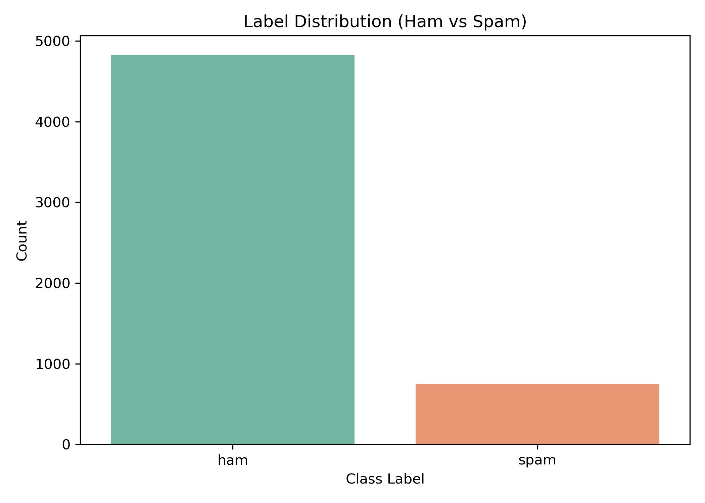
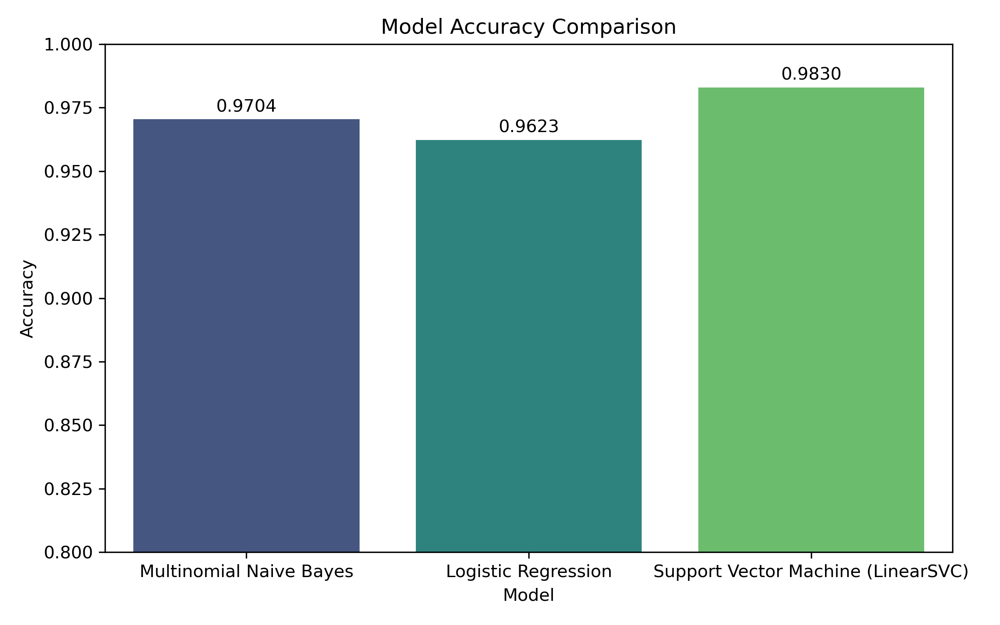
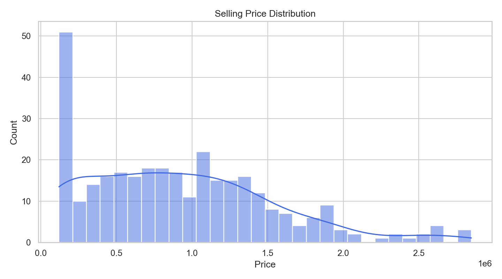
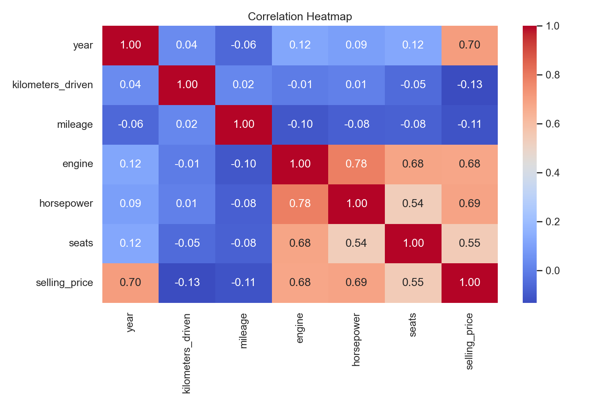
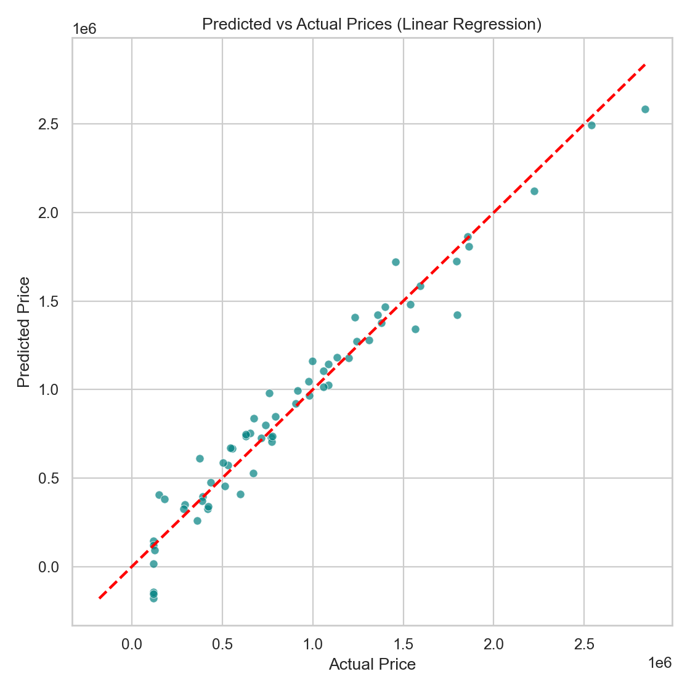

<div align="center">

# OIBSIP · Machine Learning Internship Portfolio

**Oasis Infobyte — Data Science & ML Projects**

[](https://www.python.org/)
[](https://scikit-learn.org/)
[](https://github.com/DarkFocusX)

*End-to-end workflows: data preparation · modeling · evaluation · visualization*

</div>

---

## About This Repository

> 📌 **Summary:** This repo bundles three internship-ready ML projects from **OIBSIP**—each with a clear pipeline from data to evaluation.

This repository showcases **three machine learning projects** completed during the **Oasis Infobyte Internship (OIBSIP)**. Each project follows a complete ML workflow—from loading and exploring data through training, evaluation, and saving artifacts suitable for a portfolio or internship submission.

| Aspect | Details |
|--------|---------|
| **Program** | OIBSIP (Oasis Infobyte Internship) |
| **Focus** | Classification, regression, NLP, EDA, model comparison |
| **Stack** | Python · pandas · NumPy · scikit-learn · visualization libraries |

---

## Table of Contents

| Section | Jump |
|---------|------|
| Overview | [About This Repository](#about-this-repository) |
| Projects | [Projects Overview](#projects-overview) |
| Stack | [Tech Stack](#tech-stack) |
| Libraries | [Tools & Libraries](#tools--libraries) |
| Details | [Project Details](#project-details) |
| Layout | [Repository Structure](#repository-structure) |
| Media | [Screenshots](#screenshots) |
| Skills | [Learning Outcomes](#learning-outcomes) |
| Contact | [Author](#author) |

---

## Projects Overview

🎯 **At a glance:** classification, NLP, and regression—each with comparable metrics and saved artifacts.

| # | Project | Type | Highlights |
|---|---------|------|------------|
| 1 | **Iris Flower Classification** | Classification | KNN · Iris dataset · EDA & metrics |
| 2 | **Email Spam Detection** | NLP / Classification | TF-IDF · Naive Bayes · Logistic Regression · SVM |
| 3 | **Car Price Prediction** | Regression | Feature engineering · multiple regressors · CLI inference |

---

## Tech Stack

🛠️ Core tooling used across projects:

- **Language:** Python  
- **Data:** pandas, NumPy  
- **ML:** scikit-learn  
- **Visualization:** Matplotlib, Seaborn  
- **NLP (spam project):** NLTK  
- **Artifacts:** joblib (saved models / vectorizers)

---

## Tools & Libraries

🧰 Key building blocks by category:

| Category | Tools |
|----------|--------|
| **Preprocessing** | `StandardScaler`, `OneHotEncoder`, train/test split |
| **Text (spam)** | NLTK (e.g. stemming), TF-IDF vectorization |
| **Classification** | KNN · `MultinomialNB` · `LogisticRegression` · `LinearSVC` |
| **Regression** | `LinearRegression` · `DecisionTreeRegressor` · `RandomForestRegressor` |
| **Persistence** | `joblib` for models and vectorizers |

---

## Project Details

📂 Deep dives per folder:

### 1 · Iris Flower Classification · `iris_flower_classification/`

- Classic **multi-class classification** on the Iris dataset  
- Pipeline: load data → EDA → scaling → **K-Nearest Neighbors** → accuracy, confusion matrix, classification report  
- Plots saved under `plots/` (e.g. distributions, pairplot, heatmap, confusion matrix)

---

### 2 · Email Spam Detection · `email_spam_detection/`

- **Binary text classification**: SMS as **spam** or **ham**  
- NLP preprocessing, **TF-IDF** features, comparison of **Naive Bayes**, **Logistic Regression**, and **Linear SVM**  
- Best model + vectorizer saved with **joblib**; interactive CLI prediction after training  
- Dataset under `dataset/` · outputs in `plots/` and `models/`

---

### 3 · Car Price Prediction · `car_price_prediction/`

- **Regression** for used-car **selling price** from tabular features  
- Cleaning, imputation, encoding, scaling, and **multi-model comparison** (linear, tree-based)  
- Metrics: MAE, MSE, RMSE, R² · best model saved for reuse · optional **CLI predictor**

---

## Repository Structure

🗂️ High-level layout of this internship portfolio:

```text
OIBSIP/
├── README.md
├── iris_flower_classification/
│   ├── main.py
│   ├── requirements.txt
│   ├── README.md
│   └── plots/
├── email_spam_detection/
│   ├── main.py
│   ├── requirements.txt
│   ├── README.md
│   ├── dataset/
│   ├── models/
│   └── plots/
└── car_price_prediction/
    ├── main.py
    ├── requirements.txt
    ├── README.md
    ├── dataset/
    ├── models/
    └── plots/
```

> **Tip:** Run each project from its folder after `pip install -r requirements.txt` and `python main.py` to generate plots under `plots/`.

---

## Screenshots

🖼️ **How to use this section:** run each `main.py` to generate plots under `plots/`, or replace `src` paths with your own screenshots. Markdown fallbacks are included below each row for simple edits.

### Iris Flower Classification

<p align="center">
  
  
  
</p>

| Placeholder | Suggested filename |
|-------------|-------------------|
| Class balance | `plots/class_distribution.png` |
| Feature relationships | `plots/pairplot.png` |
| Model performance | `plots/confusion_matrix.png` |

**Markdown placeholders (copy-paste friendly):**

```markdown


```

---

### Email Spam Detection

<p align="center">
  
  
  
</p>

| Placeholder | Suggested filename |
|-------------|-------------------|
| Ham vs spam counts | `plots/label_distribution.png` |
| Best model confusion matrix | `plots/confusion_matrix.png` |
| Accuracy comparison | `plots/model_accuracy_comparison.png` |

*Optional:* `plots/top_spam_words.png` — top terms in spam messages.

**Markdown placeholders:**

```markdown


```

---

### Car Price Prediction

<p align="center">
  
  
  
</p>

| Placeholder | Suggested filename |
|-------------|-------------------|
| Target distribution | `plots/price_distribution.png` |
| Feature correlations | `plots/correlation_heatmap.png` |
| Regression fit | `plots/predicted_vs_actual.png` |

**Markdown placeholders:**

```markdown


```

---

> **Note:** Until plots exist, GitHub may show broken image icons. Run `main.py` in each project or swap `src` paths to your own screenshot files.

---

## Learning Outcomes

🎓 Skills demonstrated through these projects:

| Area | Outcome |
|------|---------|
| Pipelines | End-to-end workflows: load → preprocess → train → evaluate |
| Data work | EDA, missing values, feature engineering (tabular + text) |
| Modeling | Compared multiple algorithms; read classification & regression metrics |
| NLP | Text cleaning, TF-IDF, spam/ham classification |
| MLOps-style | Saved models/vectorizers with `joblib` for reuse |
| Communication | Clear docs suitable for GitHub and internship review |

---

## Author

<div align="center">

**👤 L S Rajesh**

*Machine Learning Intern — OIBSIP*

[](https://github.com/DarkFocusX)

</div>

---

<div align="center">

If this repository helped you, consider leaving a star.

</div>
