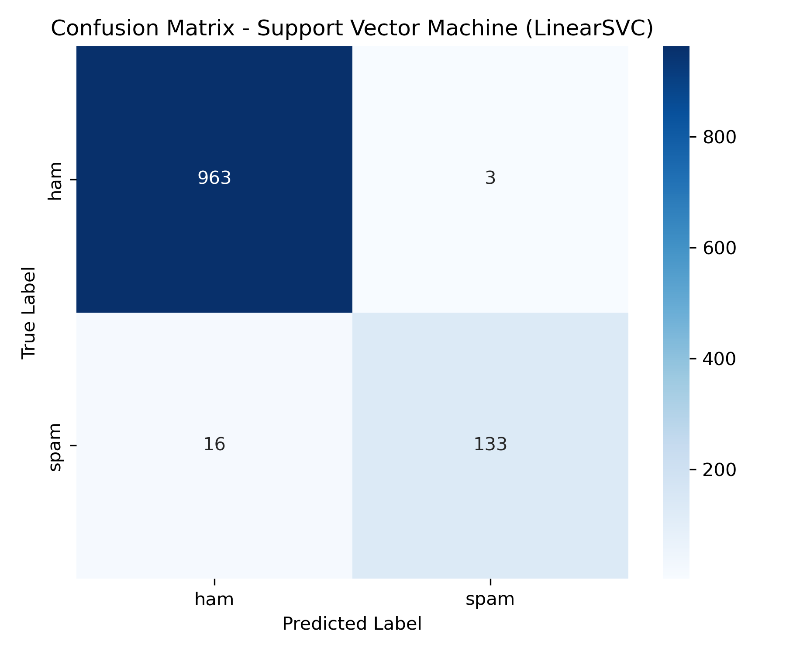

# Email Spam Detection using TF-IDF and Multiple ML Models

A professional, beginner-friendly machine learning project that classifies SMS messages as **spam** or **ham**.

This upgraded version uses:
- A **real-world SMS Spam Collection dataset** (5,572 messages)
- Better NLP preprocessing (including URL removal and stemming)
- **TF-IDF** feature extraction
- Multiple model comparison:
  - Multinomial Naive Bayes
  - Logistic Regression
  - Support Vector Machine (LinearSVC)

The project is designed for **internship submission**, **GitHub portfolio**, and easy understanding for beginners.

---

## Project Overview

Spam detection is a text classification task:
1. Clean text messages using NLP preprocessing.
2. Convert text into numbers with TF-IDF.
3. Train ML models on labeled messages.
4. Predict whether a new message is spam or ham.

This project compares multiple models and automatically reports the **best-performing model**.

---

## Project Structure

```text
email_spam_detection/
│
├── dataset/
│   └── sms_spam_collection.tsv
├── models/
│   ├── tfidf_vectorizer.joblib
│   └── best_model_svm.joblib
├── plots/
│   ├── label_distribution.png
│   ├── confusion_matrix.png
│   ├── model_accuracy_comparison.png
│   └── top_spam_words.png
├── main.py
├── requirements.txt
└── README.md
```

---

## Technologies Used

- Python
- pandas
- matplotlib
- seaborn
- scikit-learn
- nltk (Porter Stemmer)
- joblib (model/vectorizer saving and loading)

---

## Model Explanation

### 1) Multinomial Naive Bayes
- Fast and effective baseline for text classification.
- Works well with word frequency-based features.

### 2) Logistic Regression
- Linear classifier that learns weighted importance of text features.
- Often performs very well on TF-IDF text data.

### 3) Support Vector Machine (LinearSVC)
- Strong text classification model for high-dimensional sparse data.
- Frequently achieves high accuracy in spam detection tasks.

---

## Accuracy Comparison

The script trains all 3 models and prints:
- Accuracy score
- Confusion matrix
- Classification report
- Best performing model

It also saves a visual comparison chart:
- `plots/model_accuracy_comparison.png`

> On the full SMS dataset, this setup commonly reaches **95%+ accuracy** (often higher depending on split and preprocessing).

---

## Setup Instructions

### 1) Clone the repository
```bash
git clone <your-repo-link>
cd email_spam_detection
```

### 2) Install dependencies
```bash
pip install -r requirements.txt
```

### 3) Run the project
```bash
python main.py
```

### 4) Use the command-line predictor
After training completes, the script starts a live predictor:
- Type any custom message
- Get instant `spam` / `ham` prediction
- Type `exit` to stop

---

## Dataset Information

The script automatically downloads the real-world SMS dataset to:
- `dataset/sms_spam_collection.tsv`

If auto-download fails (for example, no internet), manually place a tab-separated dataset file at the same path with columns:
- `label` (`ham`/`spam`)
- `message` (text)

---

## NLP Preprocessing Steps

1. Lowercase conversion  
2. URL removal  
3. Punctuation removal  
4. Number removal  
5. Stopword removal  
6. Stemming using PorterStemmer  

These steps reduce noise and improve model learning.

---

## Generated Visualizations

The project saves these plots in `plots/`:
- `label_distribution.png` - class distribution
- `confusion_matrix.png` - confusion matrix of best model
- `model_accuracy_comparison.png` - model comparison chart
- `top_spam_words.png` - most common words in spam messages

---

## Model Saving and Loading (joblib)

After training, the script saves:
- `models/tfidf_vectorizer.joblib`
- `models/best_model_svm.joblib`

These files are loaded inside the CLI predictor so you can classify new messages instantly without retraining.

---

## Sample Predictions

The script includes custom message prediction examples for:
- spam-like messages
- normal (ham) messages

This helps beginners understand how inference works on new input text.

---

## Screenshots

Add screenshots here after running the script:

1. **Terminal Output** (accuracy + best model)  
2. **Label Distribution Plot**  
3. **Confusion Matrix Plot**  
4. **Model Accuracy Comparison Plot**  
5. **Top Spam Words Plot**

Example markdown format:
```md


```

---

## Why this project is internship-ready

- Clean and structured folder layout
- Real-world dataset
- Multiple model comparison
- Visual explanations and performance plots
- Beginner-friendly comments and documentation

---

## License

This project is free for educational and portfolio use.
